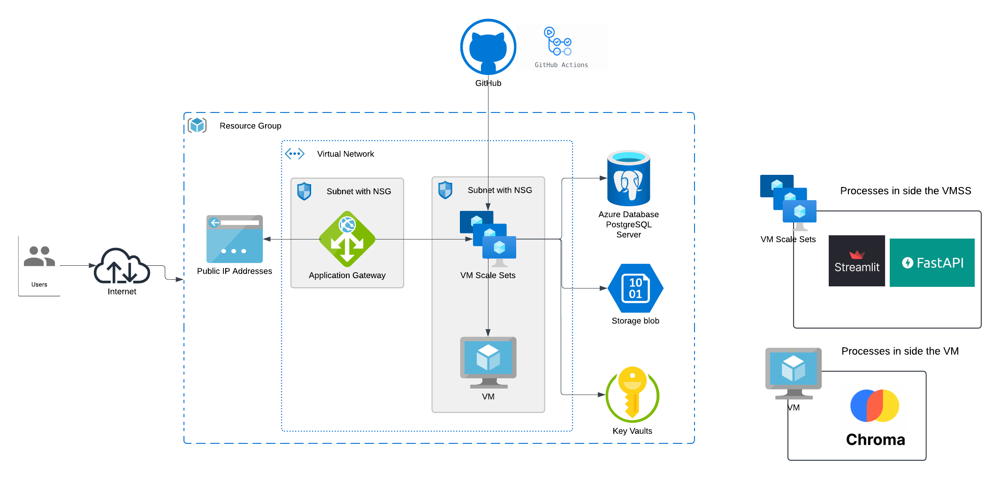

# 🚀 Azure Chatbot Infrastructure as Code (IaC) 🚀

This repository contains Terraform code to deploy a complete infrastructure for a chatbot application on Azure. The infrastructure includes networking, compute, database, storage, and security components.

## 🏗️ Architecture



The infrastructure consists of:

- 🌐 **Networking**: Virtual Network, Subnets, and Network Security Groups
- 🔄 **Application Gateway**: For load balancing and routing
- 🗄️ **Database**: PostgreSQL Flexible Server for data storage
- 📦 **Storage**: Azure Storage Account for file storage
- 💻 **Compute**: Virtual Machine Scale Set for application hosting
- 🧠 **ChromaDB**: Vector database for AI embeddings
- 🔐 **Key Vault**: Secure storage for secrets and credentials

## 📋 Prerequisites

- Terraform v1.0.0+
- Azure CLI installed and configured
- SSH key pair for VM access
- Azure subscription

## 🛠️ Setup Instructions

### 1. Clone the repository

```bash
git clone https://github.com/yourusername/azure-chatbot-infrastructure.git
cd azure-chatbot-infrastructure
```

### 2. Create a terraform.tfvars file

Create a `terraform.tfvars` file with your specific configuration values:

```hcl
subscription_id     = "your-subscription-id"
prefix              = "your-prefix"
vm_size             = "Standard_D4s_v4"
location            = "uaenorth"
resource_group_name = "your-resource-group"
vnet_name           = "your-vnet-name"
sig_image_id        = "/subscriptions/your-subscription-id/resourceGroups/image-RG/providers/Microsoft.Compute/galleries/myGallery/images/myImageDefinintion/versions/1.0.0"
sig_image_version   = "1.0.0"
storage_account_name = "yourstorageaccount"

# Database information
admin_username = "your-admin-username"
admin_password = "your-secure-password"
DB-name        = "postgres"
DB-host        = "your-psqlflexibleserver.postgres.database.azure.com"
postgres_server_name = "your-psqlflexibleserver"

# Keyvault information
ket-vault-name = "your-keyvault-name"
OpenAIkey = "your-openai-key"
DB-HOST   = "your-psqlflexibleserver.postgres.database.azure.com"
DB-PORT   = "5432"
CHROMADB-PORT = "8000"
```

### 3. Initialize Terraform

```bash
terraform init
```

### 4. Review the execution plan

```bash
terraform plan
```

### 5. Apply the configuration

```bash
terraform apply
```

### 6. Access your resources

After successful deployment, you can access your resources using the outputs:

```bash
terraform output
```

## 📁 Project Structure

```
.
├── main.tf                  # Main configuration file
├── variables.tf             # Input variables
├── outputs.tf               # Output values
├── terraform.tfvars         # Variable values (not committed)
├── modules/
│   ├── network/             # Network resources (VNet, NSG, Subnets)
│   ├── appgw/               # Application Gateway resources
│   ├── database/            # PostgreSQL Flexible Server resources
│   ├── storage/             # Storage Account resources
│   ├── compute/             # VM and VMSS resources
│   └── keyvault/            # Key Vault and secrets
└── scripts/                 # Helper scripts
```

## 🔄 CI/CD Integration

This repository can be integrated with Azure DevOps or GitHub Actions for continuous deployment. Sample workflows will be added in future updates.

## 🔒 Security Best Practices

- All sensitive values are stored in Azure Key Vault
- Network Security Groups restrict access to resources
- PostgreSQL server is configured with SSL enforcement
- All resources are deployed in private subnets where possible

## 🧹 Cleanup

To destroy the infrastructure when no longer needed:

```bash
terraform destroy
```

## 📝 License

[MIT](LICENSE)

## 🤝 Contributing

Contributions are welcome! Please feel free to submit a Pull Request.

## 📞 Support

For any questions or issues, please open an issue in the GitHub repository.
